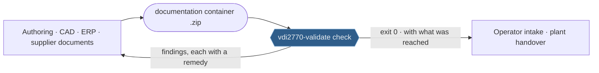
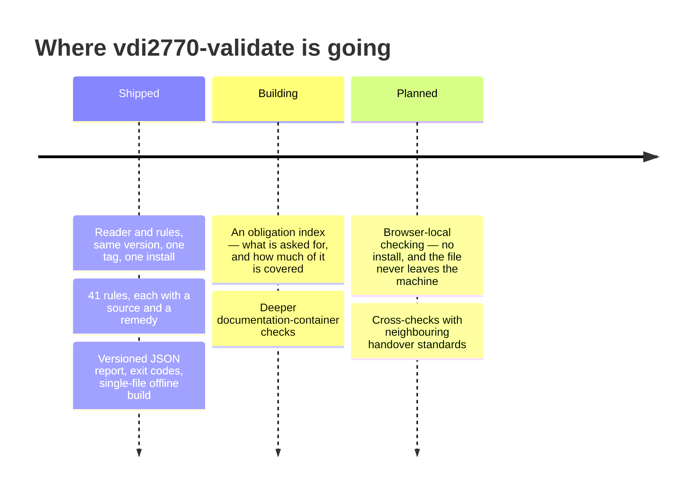

<div align="center">
  

[](https://github.com/dev365code/vdi2770-validate/actions/workflows/ci.yml)
[](https://pypi.org/project/vdi2770-validate/)
[](https://github.com/dev365code/vdi2770-validate/blob/main/docs/rules.md)
[](https://github.com/dev365code/vdi2770-validate/blob/main/LICENSE)

&nbsp;**Apache-2.0**&nbsp;·&nbsp;**Python 3.9 · 3.12 · 3.13**&nbsp;·&nbsp;**pure Python, nothing compiled**&nbsp;·&nbsp;**zero network, by design**

[Ten seconds](#ten-seconds) · [What it catches](#what-it-catches) · [Where it sits](#where-it-sits) · [Three doors](#three-doors-one-judgement) · [What it will not tell you](#what-it-will-not-tell-you) · [Roadmap](#roadmap) · [Two layers](#one-install-two-layers) · [In your product](#using-this-validator-in-your-product)

</div>

## Ten seconds


```console
$ pip install vdi2770-validate
```

**Three parts, every time: what is wrong → the evidence as read from your file → how to fix it.** A rule without a remedy does not ship.

> [!TIP]
> No install for a first try: `uvx vdi2770-validate check YOUR-CONTAINER.zip` runs it in a throwaway environment.

VDI 2770 is how manufacturers hand over technical documentation in the process
industry: PDFs bundled into ZIP "document containers" with an XML metadata file,
those bundled into a "documentation container". Operators increasingly ask for it in
purchase orders, and a container rejected on intake holds up a delivery. The
reference implementation is a Java library and web service; this is a small offline
CLI you can drop into a CI job.

> [!IMPORTANT]
> **Unofficial.** Not affiliated with VDI, the Digital Data Chain Consortium, or IDTA.
> Names are used descriptively.

It exits `0` when it found no error, `1` when it found at least one or could not
read a path you gave it, and `2` when it could read none of them. A warning does
not move the number, so `0` means *no error*, not *nothing to look at* — the
report says what it found either way. An intake gate that wants none of the
warnings either can say `--fail-on warning`; the default is `error`, because a
warning here is a warning on purpose.

<details>
<summary>The whole session the picture above is taken from, checked line by line by the test suite</summary>

The rest of this page runs on containers that ship here, so to follow along:

```bash
git clone https://github.com/dev365code/vdi2770-validate
cd vdi2770-validate
```

```
$ vdi2770-validate check corpus/examples/missingdocuments/folders.zip
folders.zip
  error  F1  A file named in the metadata is not in the container
         at folders.zip!/VDI2770_Main.xml:56:2
         'VDI2770_Main.pdf' is declared but not in the archive
         per the reference implementation - observed there, not verified against the standard (REP_007)
         -> Add the missing file to the container, or remove its DigitalFile entry from the metadata. The two must agree.
  error  Z7  The documentation container has no VDI2770_Main.pdf
         at folders.zip
         per the reference implementation - observed there, not verified against the standard (REP_025)
         -> Add the main document as VDI2770_Main.pdf at the root of the documentation container, next to VDI2770_Main.xml.
  error  Z13  Documents are delivered as folders, which this tool does not open
         at folders.zip
         2 folders hold VDI2770_Metadata.xml: 456-29201/, AB393/
         per this tool's own rule
         -> Nothing here is necessarily wrong with the container. Zip each document folder into its own .zip member if you want this tool to check it, or check those folders with something that reads them.

  … 1 more Z9 warning

  3 error(s), 1 warning(s), 0 note(s) — 1 of the errors is this tool declining to look, not the container
  read 1 of 1 archives, 1 of 3 metadata files

This tool does not verify PDF/A conformance. It reports the claim a file makes
about itself where it finds one; only a PDF/A validator can say whether that
claim is true.
```

The last line is there on every report. `0 error(s)` says what was found; that
line says how much of the container was reached, counted over the names the
archive itself lists — so a delivery whose documents are in folders this tool
does not open cannot come back looking like one it read end to end.

</details>

## What it catches

| You ship this | vdi2770-validate says |
|---|---|
| metadata that declares `VDI2770_Main.pdf`, and an archive without it | `error F1` — with the line and column of the declaration that has nothing behind it |
| a class id outside the twelve VDI 2770 publishes | `error M2` — the id is quoted back, and the twelve are listed |
| documents delivered as folders instead of nested containers | `error Z13` — and it says plainly that this is the tool declining to look, not the container being wrong |
| a member name that would escape the extraction directory | `error Z4` — refused, and nothing was ever written to disk to escape into |
| a declared PDF the scan could not confirm is a PDF | `error P5` — reported as *not confirmed*, never as *not a PDF* |
| a main document that refers to documents the handover does not contain | `error M11` — each dangling reference named, and silent when this tool did not read the whole delivery |

Every code carries a remedy and the source its requirement comes from —
[docs/rules.md](https://github.com/dev365code/vdi2770-validate/blob/main/docs/rules.md)
lists all of them.

## Where it sits



## Three doors, one judgement

| Door | For | One line |
|---|---|---|
| Terminal | build scripts, people | `vdi2770-validate check handover.zip` |
| Python | your own tooling | `import vdi2770` / `import vdi2770_validate` |
| Single file | closed networks, approvals | `python vdi2770.pyz check handover.zip` |

No route to a package index? No pip, no virtual environment, no rights to make
one? Carry **one file** in instead. It still needs a Python — that is the one
thing it cannot bring — and nothing else.

Take it from the
[latest release](https://github.com/dev365code/vdi2770-validate/releases/latest/download/vdi2770.pyz),
where its SHA-256 is printed beside it, or build the one this working tree
produces:

```bash
python tools/build_zipapp.py --check     # writes dist/vdi2770.pyz and runs it
```

Pure Python, nothing compiled, and an ordinary readable zip: whoever has to
approve software entering the network can open it and read every line, which
matters more than convenience when the approval is the hard part.

Exit codes and a versioned JSON report make it a CI gate in one line.

## What it will not tell you

**Whether a PDF really is PDF/A.** That needs a full PDF/A validator such as
veraPDF. This tool reports what a file *claims*, which catches the common failure:
files that never claimed at all. It says so on every line where it matters, and the
JSON output is one document for the run — a list with an entry per path you gave,
each carrying that `path`. An entry for a container that was checked also carries
`"pdfaVerified": false`; a path that could not be opened at all carries
`"unreadable"` and no verdict — no `pdfaVerified`, no counts, no findings —
because there is nothing to report about a file nobody read. It carries the
three fields that say what produced the run, like every other entry: a run where
some entries can be version-checked and some cannot is worse for a consumer than
one where none can.

**Documents delivered as folders.** They are reported, not opened — `Z13` above.

**What the guideline text says.** It is sold by DIN Media and was not read. Every
rule names a free source instead, or says the judgement is ours and explains
itself. The rest of the refusals are in
[docs/scope.md](https://github.com/dev365code/vdi2770-validate/blob/main/docs/scope.md).

If you want the parsed container and not a verdict, take the reader on its own —
[two layers](#one-install-two-layers), below.
[iirds-validate](https://github.com/dev365code/iirds-validate) is the same idea for
iiRDS, if that is the handover format you are on.

## Why trust the answer

- **Deterministic and offline.** No network at runtime, proven by a test that counts
  socket attempts rather than waiting for one to fail — a tool that reaches out and
  falls back quietly on error would satisfy the weaker check. Nothing is extracted to
  disk; a supplier archive does not get to pick a path on your filesystem or expand
  an XML entity.
- **Rules are data.** [`rules.json`](https://github.com/dev365code/vdi2770-validate/blob/main/packages/vdi2770/src/vdi2770/validate/data/rules.json),
  rendered as [docs/rules.md](https://github.com/dev365code/vdi2770-validate/blob/main/docs/rules.md) — each
  rule carries where its requirement comes from, a remedy sentence, and — where the
  reference implementation checks the same thing — the message keys it uses.
- **28 of 41 rules have a minimal fixture pair** — a container that violates the rule
  and a conforming one differing in as little as a single member. A 29th has a violating
  fixture and no counterpart, because there is no conforming version of *this file is not
  a ZIP*. The rest are exercised by the vendored corpus. A rule that fires nowhere fails
  the build, and every rule here has been checked against its own mutations.
- **Rules cannot reach the parser.** A test fails if a rule module imports `zipfile`
  or an XML library, so a rule cannot accidentally check how a document was spelled
  instead of what it says. Rules may read the readers' constants — the reserved file
  names, the container kinds — but not call a parser.
- **Recorded disagreements.** Where the free sources disagree, this project picks one
  reading, marks the finding, and writes down the question in
  [docs/divergences.md](https://github.com/dev365code/vdi2770-validate/blob/main/docs/divergences.md).

## Roadmap

An item moves right when it is built and checked, not when it is decided.



## One install, two layers

```bash
pip install vdi2770-validate
```

brings all of it, and there is nothing else to do. That command is also what
anybody already using this tool types, and it goes on meaning what it meant.

The layering is real and it is inside one package now. `vdi2770` opens a
container, refuses what it should refuse, and hands back a typed model with a
line number on every node — it decides nothing, it names no rule, and a test
fails if one of those modules so much as mentions a rule id. `vdi2770.validate`
is that model plus an opinion, and a rule set *is* an opinion: if your
customer's supplement disagrees with ours, or you want the parsed model for
something other than a verdict, take the readers and leave the opinion behind.

```bash
pip install vdi2770
```

```python
from vdi2770 import read_container_file

container = read_container_file("corpus/examples/container/documentcontainer.zip")
print(container.kind, len(container.members))
```

That install has no dependencies, which is a property worth keeping rather than
an accident: the schema check is the one part that needs a parser, and it is an
extra. `pip install "vdi2770[validate]"` adds it.

That install carries no command — the `vdi2770-validate` executable belongs to
the distribution of that name, and this one deliberately does not pull it in.
Run it as a module:

```bash
python -m vdi2770.validate check YOUR-CONTAINER.zip
```

The command comes with `pip install vdi2770-validate`, and it is the same code
either way. The reason the command lives there rather than here is the upgrade:
whichever distribution owns that file, pip writes it when that distribution is
installed and deletes it when that distribution's record is removed, so an
owner that changes between releases means an upgrade in which the order of two
steps decides whether the command survives. This owner does not change.

A machine that installs the readers alone and then asks for a schema check is
told so by name — the report
carries `X0` and says in its own summary that one of those errors is this tool
declining to look, not a verdict on the container.

### What is stable here, and what is not

**This is 0.x, and the packaging can still move.** This release is the example:
the validator used to be its own distribution and now lives inside the reader,
with the old name kept working as an alias. That changed how the tool is
installed and which distribution owns the executable, and it went out under a
minor version.

What has not moved, and what a build script can rely on:

- **The verdicts.** A rule that fires today fires tomorrow on the same
  container, and a rule's severity does not change quietly. Thirty-nine of the
  41 fire on a container in the corpus and are compared against the reference
  implementation, with the divergences published rather than reconciled; the
  other two — `X0` and `X5` — say that this tool could not run a check, which no
  container can cause, and they are exercised by breaking the installation, by
  making each step raise, and by making the reader hand back nothing for a
  member it accepted.
- **The exit codes.** `0` no error, `1` at least one finding at the chosen
  severity or an unreadable path, `2` nothing could be read at all — including
  a command line this tool rejected, since neither read anything — `3` this tool
  refused to judge because its two halves disagree about which release they are,
  and `141` a closed pipe. `3` is not a verdict on any container.
- **The command line.** `vdi2770-validate check <container>` and its options.
  There is one console script, and two module doors that run the same code:
  `python -m vdi2770_validate` for anything written against the old name, and
  `python -m vdi2770.validate`, which is how a `pip install "vdi2770[validate]"`
  is run because that install carries no command.
- **The report.** The JSON a run writes, and the `schemaVersion` inside it.
- **The old import name.** `import vdi2770_validate` resolves to the same
  objects as `vdi2770.validate` rather than to copies of them.

What is not stable: which distribution ships which file, the wheel layout, and
the module paths under `vdi2770.validate`. A pickle written through the new
path names the new modules, and no aliasing carries that across.

Releases come in batches rather than one per fix. Three things are published as
soon as they are ready — a security fix, a wrong verdict (a conforming package
refused, or a non-conforming one passed), and following a change in the
standard. Everything else waits for the next batch.

### What changed in 0.8, and what it means for an installation you already have

The readers and the rules used to be two distributions that had to match, and
`vdi2770-validate` named the reader with an exact pin so the pair could not be
half-moved. They are one distribution now. `vdi2770-validate` is the old import
name kept working: two lines that make it the same object as `vdi2770.validate`,
asking for `vdi2770[validate]>=0.8.2.dev0` — its own version as the floor, so
installing it can never leave you an engine older than the one it stands for.
(This page follows the working tree, so the number is the release being
prepared; each release on PyPI carries its own.)

**`pip install -U vdi2770-validate` is the upgrade, and it is now an ordinary
one.** On an installation of 0.7 that same command used to leave a tool that
could not run: the two distributions shared file paths, so installing one wrote
files the other's record still listed, and removing either took them away. The
new arrangement has no shared paths — a gate compares the built wheels against
the ones already published to say so — and the upgrade ends with everything at
the new version.

What has not gone away, because saying so would be untrue: an installation that
takes half the upgrade still has old rules in it. If
you move the engine forward and leave the old `vdi2770-validate` behind, that
older package keeps its own command and goes on judging with its own rules —
honestly, under its own version number, which is what its reports say. And if
the halves that are loaded disagree about which release they are, the tool
refuses to judge rather than sign a verdict it cannot account for: exit 3, on a
line beginning `vdi2770-validate: INSTALLATION`. That is not a verdict on any
container — it is this tool saying it cannot account for itself, and it belongs
in a bug report against this project rather than against a supplier's
delivery.

Everything written against the old name goes on working — `import
vdi2770_validate`, `from vdi2770_validate.cli import main`, `python -m
vdi2770_validate` and the command itself. One thing cannot be carried across: a
pickle written through the new module path names `vdi2770.validate.…`, and code
that only has the old release cannot read it.

## The classification table, and a disagreement

VDI 2770 defines twelve document classes. Two sources publish that table for free —
IDTA 02004 v2.0.1 Table 1, and the MIT reference implementation. Both renderings of
every name are stored, so you can check rather than trust: **they agree on all twelve
German names and disagree on five English ones** (02-03, 02-04, 03-01, 03-04,
04-01). So matching here is keyed on the class id and the German name, and an
English name never fails a document — it produces a note that shows both renderings.

```
$ vdi2770-validate classes
02-03  Bauteile                                   Assemblies   [sources disagree]
      English — IDTA 02004: 'Assemblies'   reference impl: 'Components'
```

Details in [docs/divergences.md](https://github.com/dev365code/vdi2770-validate/blob/main/docs/divergences.md).

## Using this validator in your product

<details>
<summary>Embedding, versions and support</summary>

Apache-2.0. You may embed it in commercial products, ship it to your customers and
run it inside closed networks; keep the LICENSE and NOTICE files with it. A run
makes no network requests and uploads nothing. The surfaces you can build on are the
report JSON, the exit codes and the command-line options documented above — those
are versioned, and a change to any of them is announced as a breaking change in the
CHANGELOG. Everything else may change between releases.

Releases follow semantic versioning, and the reader and the rule set move together
under one tag. Released files are not deleted; a release with a security problem is
marked as yanked and superseded, so a version you have pinned keeps installing. When
the free sources a rule is built on change, the CHANGELOG says what changed in the
judgement and why.

The software is free and stays free, and there is no paid tier of the judgement
itself: a free run and a supported run give the same result on the same file.
Professional support is available for the work around it — update guarantees when
the sources change, backports to a version you have frozen, help with embedding, and
change-impact notes for your product. Contact: zero8004paz@gmail.com. For security
reports see
[SECURITY.md](https://github.com/dev365code/vdi2770-validate/blob/main/SECURITY.md).

</details>

## Licensing

Apache-2.0. The VDI 2770 guideline text is sold by DIN Media and was **not** read,
quoted, or paraphrased. Every rule names its source in `rules.json` instead: the schema
VDI publishes free, a freely published table, ZIP and XML mechanics, the MIT reference
implementation (observed there, not verified against the standard), or a judgement of
our own that has to explain itself.
See [docs/licensing.md](https://github.com/dev365code/vdi2770-validate/blob/main/docs/licensing.md) and [NOTICE](https://github.com/dev365code/vdi2770-validate/blob/main/NOTICE).

Contributions take a `Signed-off-by` line (DCO).

## Related

[iirds-validate](https://github.com/dev365code/iirds-validate) — the same idea for
iiRDS. [standards-watch](https://github.com/dev365code/standards-watch) — a daily
watch on these standards.
